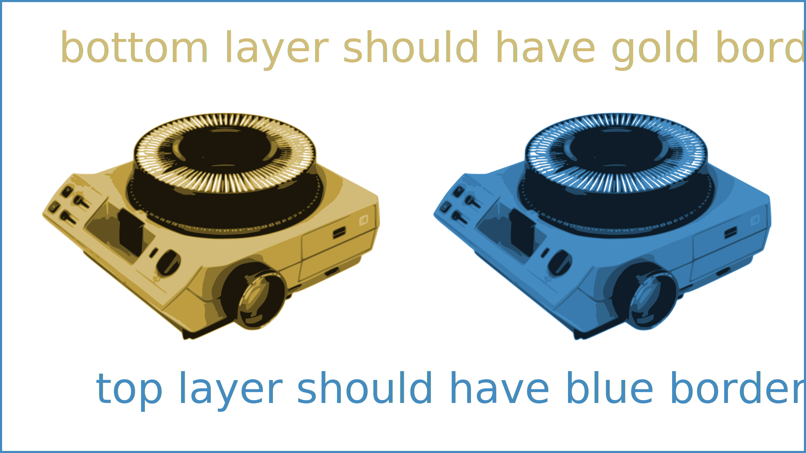
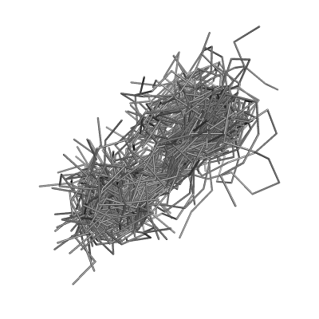

## slidemachine demo presentation

>>>

Red to red + blue


>>>>

red to blue
 10,01

>>>>

# header1
## header2
### header3
#### header4
##### header5
###### header6

>>>>

normal
*italic*
**bold**
**__bold and italic__**
~~strike through~~

>>>>

a list
+ entry 1
    + a
    + b
+ entry 2

>>>>

[I'm an inline-style link](https://www.google.com)

>>>>

Horizontal rule

---

>>>>

a normal image



>>>>

The next slide is blank

>>>>

>>>>

inline math: $\frac{1}{2} = 0.5^{1}$

other math

$$\frac{1}{4} = 0.25^{1}$$

>>>>

some bootstrap

<div class="row">
    <div class="col-xs-6">
        
    </div>
    <div class="col-xs-6">
        
    </div>
</div>

>>>>

python code block

```python
import slidemachine
print(10)
```

